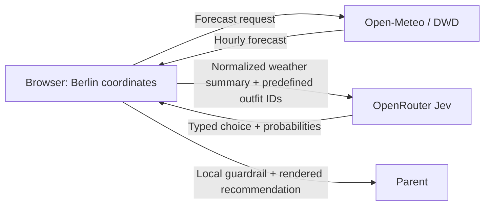

# Toddler Outfit Advisor — Prototype Design Document

> **Purpose:** A Claude Code–ready specification for a small, intuitive web app that recommends what a three-year-old should wear to kindergarten in Berlin each morning.
>
> **Implementation target:** Vanilla JavaScript (ECMAScript 2025), Vite, Vitest, and no TypeScript.
>
> **Important naming clarification:** this document interprets “OpenRoute API key” in the brief as an **OpenRouter API key**. The weather service specified below, Open-Meteo, does **not** need an API key for this non-commercial prototype.

---

## 1. Product summary

**Toddler Outfit Advisor** turns Berlin’s forecast into one clear, parent-controlled clothing recommendation. It shows:

1. a visual illustration of the recommended outfit;
2. a readable list of garments to put on;
3. a graphic, hour-by-hour view of today’s weather; and
4. short, transparent reasons such as “Chilly at drop-off” and “Rain likely after lunch.”

The app uses a local, deterministic safety layer plus **Jev** through OpenRouter to select from predefined outfits. Jev is a typed decision model: it selects one allowed option and returns probabilities, rather than generating arbitrary prose. That makes it appropriate for a constrained recommendation workflow, but the app must never treat it as a safety authority or medical advice.

### 1.1 Target user and morning flow

The primary user is a parent at home in the morning, likely using a phone.

1. Open the app.
2. See today’s Berlin forecast and the default weather-rules recommendation immediately.
3. Optionally enter an OpenRouter key in a session-only prompt to get the Jev decision.
4. Read the prominent outfit illustration, garment checklist, and “why” chips.
5. Check the hourly chart if a rain or temperature change is expected later.
6. Make the final parent decision.

The app should feel useful in under **10 seconds**, without requiring an account or configuration before weather information appears.

### 1.2 Product principles

- **One clear answer first.** The main recommendation is unmissable; details are available but secondary.
- **No invented garments.** AI may choose only from the outfit catalog passed in the request.
- **Conservative around rain and cold.** A local guardrail may reject an AI choice and use the deterministic fallback.
- **Transparent rather than authoritative.** Show the actual weather signals used and communicate that a parent should consider the child, activity level, and kindergarten policy.
- **Private by default.** No accounts, analytics, tracking, or server-side storage in the prototype.
- **Mobile-first and accessible.** Large tap targets, readable contrast, keyboard usability, and a text alternative for every visual chart.

---

## 2. Scope

### In scope for prototype v1

- Berlin as the preconfigured location (`52.5200, 13.4050`, `Europe/Berlin`).
- Fetch the current conditions and today’s hourly forecast.
- Display a composable, in-app SVG outfit illustration — no third-party image assets required.
- Display five parent-supplied canonical outfit combinations.
- Make a deterministic rules recommendation without an AI key.
- Prompt for an OpenRouter API key and call Jev when the user opts in.
- Render Jev confidence and explain whether the local safety check accepted the AI result.
- Render an hourly temperature/apparent-temperature line plus precipitation-probability bars.
- Handle loading, stale, network, API, invalid-key, and AI-unavailable states gracefully.
- Unit and DOM/integration tests with Vitest.

### Explicitly out of scope for v1

- Login, user accounts, sync, notifications, email, or background jobs.
- A production backend or server-side secret storage.
- Medical, health, UV, allergy, or school-policy guidance.
- Automatic purchase lists or wardrobe inventory.
- Historical personalization or learning from past parent choices.
- A claim that the app is “accurate” or a guarantee that a child will be warm/dry.

### Design-for-later, but do not build in v1

- Location search and saved locations.
- Parent-adjustable temperature/rain thresholds.
- A visual editor for additional outfit combinations.
- A tiny backend/edge proxy that protects the OpenRouter key.
- Localization (start English; keep all visible strings in one `copy.js` module so German can be added cleanly).

---

## 3. Integration decisions and trade-offs

### 3.1 Weather data options

| Approach | Trade-offs | Cost | Setup complexity |
| --- | --- | ---: | --- |
| **Open-Meteo using DWD ICON-D2** | No client secret; direct browser-friendly forecast request; DWD’s high-resolution Germany/Central Europe model is highly relevant to Berlin. This is weather-model output, not a guarantee. | Free/open-access tier for non-commercial prototype use; rate limits apply. | Low |
| **meteoblue Forecast API** | Strong multi-model/observation approach and forecast products, but requires an API key/trial and introduces client-side key-protection work in a pure frontend app. | Trial/free offering exists; paid usage is request/plan based. | Medium |

**Prototype selection dictated by the brief:** use **Open-Meteo with `models=dwd_icon_d2`**. It best fits “cheap, precise for Berlin, pure frontend” because it requires no weather key. Open-Meteo documents ICON-D2 as roughly 2 km, 15-minute data for Central Europe with updates every three hours; the prototype renders the safer, easier-to-read hourly series.

### 3.2 AI-key handling options

| Approach | Trade-offs | Cost | Setup complexity |
| --- | --- | ---: | --- |
| **Browser-only, session-only key prompt** | Matches the stated first-prototype constraint. The bearer key is present in the user’s browser during the request, so this is appropriate only for a personal/local prototype or a key with a strict cap. | Jev usage plus any OpenRouter credit chosen by the key owner. | Low |
| **Small server/edge proxy** | Keeps the key off the browser and is the correct direction for a shared or public deployment. Requires hosting and basic abuse controls. | Usually low hosting cost plus Jev usage. | Medium |

**Prototype behavior:** implement the first option because the brief explicitly requires a pure frontend. Make the security limitation highly visible in the key dialog. Never persist the key, include it in source code, send it to logging, place it in a URL, or send it to the weather provider.

> OpenRouter recommends a credit limit on every key and warns that unrestricted keys must be kept out of client code. A user running this prototype should create a **separate, low-credit-limit key** specifically for it. The key dialog must also offer **“Skip AI — use weather rules”**.

**Mandatory implementation spike:** before treating the browser-only AI path as ready, make a manual cross-origin request from the Vite dev server with a disposable, capped key. If the browser blocks the request because of CORS or OpenRouter changes its policy, retain the fully usable weather-rules mode and defer Jev until a secure proxy exists. Do not attempt to bypass browser security.

---

## 4. Technology and project setup

### Required stack

- **Language:** ECMAScript 2025 JavaScript; no TypeScript files, types, transpiled type syntax, React, Vue, or other frontend framework.
- **Tooling:** Vite (vanilla template) and Vitest.
- **Test DOM:** jsdom, used only in development tests.
- **Runtime dependencies:** none.
- **Chart:** custom Canvas 2D implementation plus an accessible HTML text/table alternative. Do not add a chart library for this one chart.
- **Illustration:** SVG and CSS defined in the app; do not fetch remote image assets.

### Bootstrap commands

```bash
npm create vite@latest toddler-outfit-advisor -- --template vanilla
cd toddler-outfit-advisor
npm install
npm install --save-dev vitest jsdom
```

Add these npm scripts while retaining Vite’s normal scripts:

```json
{
  "scripts": {
    "dev": "vite",
    "build": "vite build",
    "preview": "vite preview",
    "test": "vitest run",
    "test:watch": "vitest"
  }
}
```

### Required project structure

```text
toddler-outfit-advisor/
├── index.html
├── package.json
├── vite.config.js
├── src/
│   ├── main.js
│   ├── styles.css
│   ├── copy.js
│   ├── data/
│   │   └── outfits.js
│   ├── domain/
│   │   ├── forecast.js
│   │   ├── recommendation.js
│   │   └── validators.js
│   ├── services/
│   │   ├── weather-service.js
│   │   ├── jev-service.js
│   │   └── session-key.js
│   └── ui/
│       ├── app.js
│       ├── recommendation-card.js
│       ├── outfit-illustration.js
│       ├── hourly-chart.js
│       ├── key-dialog.js
│       └── status-banner.js
└── tests/
    ├── setup.js
    ├── fixtures.js
    ├── forecast.test.js
    ├── recommendation.test.js
    ├── validators.test.js
    ├── weather-service.test.js
    ├── jev-service.test.js
    └── app.test.js
```

Use native ES modules throughout. Keep business logic in `src/domain/`; UI modules must not decide which outfit is appropriate.

---

## 5. Outfit catalog and recommendation policy

### 5.1 Canonical v1 catalog

Use stable IDs. Visible labels should be friendly and correct the obvious misspellings in the source requirements (`pants`, `sweater`, `socks`). In the UI, label “water shoes” as **“waterproof shoes”** with an optional parent-facing parenthetical “(water shoes)” until the wording is confirmed.

| ID | Parent-facing name | Garments |
| --- | --- | --- |
| `sunny-hot` | Sunny & hot | Short-sleeve T-shirt; shorts; sandals |
| `mild-dry` | Mild & dry | Long pants; long-sleeve T-shirt; sweater; socks; closed shoes |
| `fresh-dry` | Fresh & dry | Long pants; long-sleeve T-shirt; sweater; jacket; socks; closed shoes |
| `cold-dry` | Cold & dry | Long pants; long-sleeve T-shirt; sweater; jacket; scarf; hat; socks; closed shoes |
| `cold-rain` | Cold & rainy | Long pants; long-sleeve T-shirt; sweater; jacket; scarf; hat; umbrella; socks; waterproof shoes; rain pants |

Define this once in `src/data/outfits.js` rather than duplicating garment strings in the UI, rules, tests, and AI prompt.

```js
export const OUTFITS = [
  {
    id: 'sunny-hot',
    label: 'Sunny & hot',
    description: 'Light clothes for a dry, warm, sunny kindergarten day.',
    garments: ['Short-sleeve T-shirt', 'Shorts', 'Sandals'],
    visualLayers: ['shortTee', 'shorts', 'sandals'],
    tags: ['dry', 'warm', 'sunny']
  },
  {
    id: 'mild-dry',
    label: 'Mild & dry',
    description: 'Layers for a mild, cloudy or partly cloudy dry day.',
    garments: ['Long pants', 'Long-sleeve T-shirt', 'Sweater', 'Socks', 'Closed shoes'],
    visualLayers: ['longTee', 'sweater', 'longPants', 'socks', 'shoes'],
    tags: ['dry', 'mild']
  },
  {
    id: 'fresh-dry',
    label: 'Fresh & dry',
    description: 'A warmer outer layer for a fresh dry day.',
    garments: ['Long pants', 'Long-sleeve T-shirt', 'Sweater', 'Jacket', 'Socks', 'Closed shoes'],
    visualLayers: ['longTee', 'sweater', 'jacket', 'longPants', 'socks', 'shoes'],
    tags: ['dry', 'fresh']
  },
  {
    id: 'cold-dry',
    label: 'Cold & dry',
    description: 'Warm layers with head and neck protection for a cold dry day.',
    garments: ['Long pants', 'Long-sleeve T-shirt', 'Sweater', 'Jacket', 'Scarf', 'Hat', 'Socks', 'Closed shoes'],
    visualLayers: ['longTee', 'sweater', 'jacket', 'longPants', 'scarf', 'hat', 'socks', 'shoes'],
    tags: ['dry', 'cold']
  },
  {
    id: 'cold-rain',
    label: 'Cold & rainy',
    description: 'Warm, rain-ready layers for a cold wet day.',
    garments: ['Long pants', 'Long-sleeve T-shirt', 'Sweater', 'Jacket', 'Scarf', 'Hat', 'Umbrella', 'Socks', 'Waterproof shoes', 'Rain pants'],
    visualLayers: ['longTee', 'sweater', 'jacket', 'longPants', 'scarf', 'hat', 'socks', 'waterproofShoes', 'rainPants', 'umbrella'],
    tags: ['rain', 'cold']
  }
];
```

### 5.2 “Other combinations” without uncontrolled AI output

The initial catalog should be exactly the five combinations above. Build the data model to support additional records later, but **do not** ask Jev to invent extra garments in v1.

Later combinations can be added as catalog entries with the same fields. Examples to consider only after a parent specifies their actual wardrobe:

- warm but rainy;
- windy but dry;
- spare clothes to pack in the backpack;
- a lighter rain-shell option.

The recommendation view can already support a `baseOutfit` plus `addOns` structure so a future “mild rain” record does not require a rewrite.

### 5.3 Configurable defaults

Place thresholds in a small exported constant in `src/domain/recommendation.js`. These are **defaults**, not objective child-safety thresholds. Give the user a future settings surface rather than hard-coding an unchangeable claim.

```js
export const DEFAULTS = {
  timezone: 'Europe/Berlin',
  kindergartenStartHour: 8,
  kindergartenEndHour: 17,
  hotMinimumApparentC: 22,
  mildMinimumApparentC: 16,
  freshMinimumApparentC: 9,
  sunnyMaximumCloudCover: 35,
  sunnyMinimumFraction: 0.65,
  rainProbabilityThreshold: 50,
  rainAmountThresholdMm: 0.3,
  coldRainMaximumApparentC: 12,
  minimumAiConfidence: 0.60,
  cacheMinutes: 15
};
```

The time window is deliberate: the user says “whole day,” but the decision should evaluate the typical kindergarten/outdoor window (08:00–17:00), not a cold late night. Show the evaluated window in the interface.

### 5.4 Deterministic baseline algorithm

`deriveDaySummary(forecast, DEFAULTS)` should work only on the selected local time window and return a plain object such as:

```js
{
  window: { start: '08:00', end: '17:00', hourCount: 10 },
  minApparentC: 7.4,
  maxApparentC: 13.1,
  rainLikely: true,
  maxRainProbability: 70,
  precipitationTotalMm: 2.1,
  sunnyFraction: 0.10,
  maxWindKmh: 22,
  reasons: [
    'Feels as cool as 7°C during kindergarten hours',
    'Rain is likely (up to 70%)',
    'Breezy at times (up to 22 km/h)'
  ]
}
```

Rules, in order:

```text
1. Evaluate only 08:00–17:00 local Berlin time.
2. rainLikely = any hourly precipitation probability >= 50
                OR total precipitation in the window >= 0.3 mm.
3. hotAndSunny = rainLikely is false
                 AND minimum apparent temperature >= 22°C
                 AND at least 65% of window hours have cloud cover <= 35%.
4. If rainLikely AND minimum apparent temperature < 12°C: choose cold-rain.
5. Else if hotAndSunny: choose sunny-hot.
6. Else if minimum apparent temperature >= 16°C: choose mild-dry.
7. Else if minimum apparent temperature >= 9°C: choose fresh-dry.
8. Else: choose cold-dry.
```

For a future warm-rain catalog, choose a dry base outfit using steps 5–8 then add rain gear. In v1, if rain is likely but not cold, preserve the nearest dry base outfit **and add a prominent “Pack rain gear” note**; do not force the `cold-rain` outfit on a warm day.

### 5.5 Local safety validation of AI output

The app must obtain and render a deterministic recommendation before it calls Jev. The AI result may replace it only when all checks pass.

Reject the Jev output and retain the deterministic choice when any condition below applies:

- the returned outfit ID is absent from `OUTFITS`;
- `recommended_outfit.type !== 'choice'`;
- `recommended_outfit.confidence < 0.60`;
- the day is rainy and the AI selected an outfit without `rain` tag or the special warm-rain add-on path;
- `minApparentC < 9` and the selected outfit does not include jacket, hat, and scarf;
- `hotAndSunny` is true and the selected outfit has cold-only garments (jacket, scarf, or hat);
- the rain-gate answer conflicts strongly with the local precipitation summary; or
- the request fails, times out, parses incorrectly, or is blocked by the browser.

Display a calm non-alarming status such as:

> “Weather rules selected this outfit because the AI result was uncertain. You can still review the forecast below.”

Never send a free-text prompt that permits the model to add garments, rewrite the catalog, or give health advice.

---

## 6. Weather integration

### 6.1 Provider and endpoint

Use Open-Meteo’s forecast API with DWD ICON-D2 for the Berlin default.

```text
GET https://api.open-meteo.com/v1/forecast
```

Build the URL with `URL` and `URLSearchParams`; do not hand-concatenate user-controlled values.

```js
const endpoint = new URL('https://api.open-meteo.com/v1/forecast');
endpoint.search = new URLSearchParams({
  latitude: '52.5200',
  longitude: '13.4050',
  current: [
    'temperature_2m',
    'apparent_temperature',
    'precipitation',
    'weather_code',
    'cloud_cover',
    'wind_speed_10m'
  ].join(','),
  hourly: [
    'temperature_2m',
    'apparent_temperature',
    'precipitation_probability',
    'precipitation',
    'weather_code',
    'cloud_cover',
    'wind_speed_10m',
    'wind_gusts_10m',
    'is_day'
  ].join(','),
  daily: [
    'weather_code',
    'temperature_2m_max',
    'temperature_2m_min',
    'apparent_temperature_max',
    'apparent_temperature_min',
    'precipitation_probability_max',
    'precipitation_sum',
    'sunrise',
    'sunset'
  ].join(','),
  forecast_days: '1',
  timezone: 'Europe/Berlin',
  models: 'dwd_icon_d2'
});
```

A live validation on 25 September 2026 confirmed that this shape returns the requested current fields, hourly fields, daily fields, 24 hourly records, and `Europe/Berlin` timestamps.

### 6.2 Fetching behavior

Implement `fetchBerlinForecast({ signal } = {})` in `weather-service.js`.

- Use `fetch` with an `AbortController` and an 8-second timeout.
- Throw a typed `WeatherServiceError` with a safe user-facing message for non-OK responses, invalid JSON, and malformed payloads.
- Normalize every API response into an application-owned forecast structure; components must not consume provider JSON directly.
- Cache the normalized result plus `fetchedAt` in `sessionStorage` for 15 minutes. This avoids needless calls while remaining fresh enough for a morning check.
- Include a **Refresh** button. It bypasses the cache, aborts a prior in-flight request, and sets `aria-busy="true"` on the weather region.
- If the explicit `dwd_icon_d2` request fails because of an availability issue, retry once with `models=auto`; annotate the developer-only normalized source as `auto`. Do not expose technical model names in the parent UI.
- Do not store weather data remotely.

### 6.3 Normalized domain shape

```js
{
  location: { label: 'Berlin', latitude: 52.52, longitude: 13.405 },
  timezone: 'Europe/Berlin',
  fetchedAt: '2026-09-25T07:05:00.000Z',
  current: {
    time: '2026-09-25T09:00',
    temperatureC: 10.2,
    apparentTemperatureC: 8.9,
    precipitationMm: 0,
    weatherCode: 3,
    cloudCoverPercent: 94,
    windKmh: 16
  },
  hours: [{
    time: '2026-09-25T08:00',
    hour: 8,
    temperatureC: 9.8,
    apparentTemperatureC: 8.1,
    precipitationProbabilityPercent: 15,
    precipitationMm: 0,
    weatherCode: 2,
    cloudCoverPercent: 70,
    windKmh: 14,
    windGustKmh: 24,
    isDay: 1
  }],
  day: {
    date: '2026-09-25',
    lowC: 7.8,
    highC: 15.2,
    apparentLowC: 6.0,
    apparentHighC: 13.6,
    precipitationProbabilityMaxPercent: 70,
    precipitationTotalMm: 2.1,
    weatherCode: 61,
    sunrise: '2026-09-25T06:53',
    sunset: '2026-09-25T19:05'
  }
}
```

### 6.4 Weather-code presentation

Map documented WMO codes to a small app-owned metadata object:

```js
export const WEATHER_META = {
  0: { label: 'Clear sky', icon: 'sun' },
  1: { label: 'Mostly clear', icon: 'sun-cloud' },
  2: { label: 'Partly cloudy', icon: 'cloud-sun' },
  3: { label: 'Overcast', icon: 'cloud' },
  45: { label: 'Foggy', icon: 'fog' },
  48: { label: 'Icy fog', icon: 'fog' },
  51: { label: 'Light drizzle', icon: 'drizzle' },
  53: { label: 'Drizzle', icon: 'drizzle' },
  55: { label: 'Heavy drizzle', icon: 'drizzle' },
  61: { label: 'Light rain', icon: 'rain' },
  63: { label: 'Rain', icon: 'rain' },
  65: { label: 'Heavy rain', icon: 'rain' },
  71: { label: 'Light snow', icon: 'snow' },
  73: { label: 'Snow', icon: 'snow' },
  75: { label: 'Heavy snow', icon: 'snow' },
  80: { label: 'Rain showers', icon: 'rain' },
  81: { label: 'Heavy showers', icon: 'rain' },
  82: { label: 'Violent showers', icon: 'rain' },
  95: { label: 'Thunderstorm', icon: 'storm' },
  96: { label: 'Thunderstorm with hail', icon: 'storm' },
  99: { label: 'Severe thunderstorm with hail', icon: 'storm' }
};
```

Use an `unknown` fallback for unmapped codes so an API update cannot break the UI.

---

## 7. Jev/OpenRouter decision integration

### 7.1 Model and endpoint

Use the pinned model ID **`typesafe/jev-1.13`**, not the moving `~typesafe/jev-latest` alias. The pinned ID protects calibrated threshold behavior within the prototype.

```text
POST https://openrouter.ai/api/alpha/decisions
Authorization: Bearer <session-only OpenRouter key>
Content-Type: application/json
```

Jev 1.13 is designed for typed choices, yes/no (`noul`), and ordered scores. At the time of this document, its published price is **$0.042 per million input tokens and $0 per million output tokens**. Treat the price as changeable: the app should display no hard-coded price claim.

### 7.2 Session-only key UX and security

Implement `session-key.js` as a module-private in-memory variable:

```js
let openRouterKey = '';

export function setOpenRouterKey(value) {
  openRouterKey = value.trim();
}

export function getOpenRouterKey() {
  return openRouterKey;
}

export function clearOpenRouterKey() {
  openRouterKey = '';
}
```

**Do not put the key in** `localStorage`, `sessionStorage`, IndexedDB, cookies, `.env`, `import.meta.env`, HTML, Git, a URL, a status message, an exception, analytics, or `console.log`.

Key dialog requirements:

- Native `<dialog>` where supported, with a CSS fallback only if needed.
- Password input, `autocomplete="off"`, explicit label, and show/hide control.
- Copy: “This prototype sends the key directly from your browser to OpenRouter. Use a separate key with a small credit limit. The app keeps it only until this tab is closed or you choose Forget key.”
- Buttons: **Use AI decision**, **Skip AI — use weather rules**, and **Forget key** after a key has been entered.
- Do not automatically call Jev after a fresh key entry until a valid weather summary exists.
- A failed key must yield a generic message: “The AI decision could not be loaded. Weather rules are still active.” Never echo a response body that could expose credentials.

### 7.3 Decision request

`buildJevRequest({ daySummary, outfits })` returns JSON serializable data. Keep the state minimal and factual. Do not send a child’s name, date of birth, exact location, or any other unnecessary personal data.

```js
{
  model: 'typesafe/jev-1.13',
  state: {
    location: 'Berlin',
    child_context: 'A toddler attends kindergarten. This app only chooses from the supplied outfits; the parent makes the final decision.',
    assessment_window: '08:00–17:00 Europe/Berlin',
    weather: {
      min_apparent_c: 7.4,
      max_apparent_c: 13.1,
      rain_likely: true,
      max_rain_probability_percent: 70,
      precipitation_total_mm: 2.1,
      sunny_fraction: 0.1,
      max_wind_kmh: 22
    },
    available_outfits: {
      'sunny-hot': 'Short-sleeve T-shirt, shorts, sandals. Dry, hot and sunny throughout the kindergarten day.',
      'mild-dry': 'Long pants, long-sleeve T-shirt, sweater, socks and closed shoes. Mild and dry.',
      'fresh-dry': 'Long pants, long-sleeve T-shirt, sweater, jacket, socks and closed shoes. Fresh and dry.',
      'cold-dry': 'Long pants, long-sleeve T-shirt, sweater, jacket, scarf, hat, socks and closed shoes. Cold and dry.',
      'cold-rain': 'Long pants, long-sleeve T-shirt, sweater, jacket, scarf, hat, umbrella, socks, waterproof shoes and rain pants. Cold and rainy.'
    }
  },
  questions: {
    recommended_outfit: {
      type: 'choice',
      instructions: 'Choose exactly one available outfit ID. Prefer rain protection when rain is likely and warmer layers when the apparent temperature is low. Never choose an ID not listed in the criteria.',
      criteria: {
        'sunny-hot': 'Use only when the day is dry, hot, and mostly sunny during the assessment window.',
        'mild-dry': 'Use for a dry mild day that does not require a jacket.',
        'fresh-dry': 'Use for a dry fresh day needing a jacket but not scarf and hat.',
        'cold-dry': 'Use for a cold dry day needing jacket, scarf, and hat.',
        'cold-rain': 'Use for a cold wet day needing rain protection plus warm layers.'
      }
    },
    rain_gear_required: {
      type: 'noul',
      instructions: 'Is rain gear important for the kindergarten assessment window?',
      criteria: {
        true: 'Rain is likely or meaningful precipitation is forecast during the assessment window.',
        false: 'Rain is not likely and little or no precipitation is forecast during the assessment window.'
      }
    },
    warmth_level: {
      type: 'score',
      instructions: 'How much warmth is appropriate for the assessment window?',
      criteria: [
        'Light clothes only',
        'Light layers',
        'Jacket needed',
        'Jacket, scarf, and hat needed'
      ]
    }
  }
}
```

### 7.4 Jev response handling

Expected relevant response fields:

```js
{
  answers: {
    recommended_outfit: {
      type: 'choice',
      choice: 'cold-rain',
      confidence: 0.82,
      probabilities: { 'sunny-hot': 0, 'mild-dry': 0.02, 'fresh-dry': 0.05, 'cold-dry': 0.11, 'cold-rain': 0.82 }
    },
    rain_gear_required: { type: 'noul', noul: 0.97 },
    warmth_level: { type: 'score', score: 2.89, confidence: 0.95 }
  },
  usage: { input_tokens: 0, output_tokens: 0, cost: 0 }
}
```

Create a normalized `aiDecision` object containing only the outcome needed for UI and validation:

```js
{
  requested: true,
  accepted: true,
  outfitId: 'cold-rain',
  confidence: 0.82,
  rainGearProbability: 0.97,
  warmthScore: 2.89,
  source: 'jev'
}
```

Never show raw API payloads or token/cost details in the parent-facing interface. A compact `<details>` element may show: “AI decision used · confidence 82% · checked against local weather rules.”

---

## 8. Interface specification

### 8.1 Visual direction

Create a warm, calm, modern interface for a busy parent. It should be playful enough to feel child-adjacent but not cartoonish or cluttered.

**Design tokens:**

```css
:root {
  --ink: #1E293B;
  --muted-ink: #5B6473;
  --paper: #F8FAFC;
  --card: #FFFFFF;
  --line: #E2E8F0;
  --sun: #FBBF24;
  --sky: #60A5FA;
  --rain: #4F7FE6;
  --leaf: #2E8B73;
  --warm: #F97316;
  --danger: #B42318;
  --focus: #1D4ED8;
  --radius-card: 24px;
  --shadow-card: 0 12px 28px rgb(15 23 42 / 0.08);
}
```

- Use a system sans-serif stack, 16px minimum body size, 44px minimum touch targets.
- Prefer text labels plus icons; never rely on color alone.
- No external web fonts, remote icon kits, or image CDNs.
- Respect `prefers-reduced-motion` and use no auto-playing animation.

### 8.2 Page structure

```text
<header>
  Brand: “Ready for Kindergarten”
  Location: Berlin · Updated 07:12
  [Refresh]
</header>

<main>
  <section aria-labelledby="today-heading">                 // Weather snapshot
    Today in Berlin · Friday, 25 September
    10°C now · feels like 8°C · Overcast
    “We check 08:00–17:00 for kindergarten.”
  </section>

  <section aria-labelledby="outfit-heading">                // Primary recommendation
    “Put on today”
    Large composable child/outfit illustration
    Cold & rainy
    Garment checklist
    Reason chips
    [View decision details]
    [Use AI decision / Change key] [Forget key]
  </section>

  <section aria-labelledby="forecast-heading">              // Hourly evidence
    “Today, hour by hour”
    Canvas chart
    Text legend
    Accessible hourly table in <details>
  </section>

  <section aria-labelledby="tips-heading">                  // Calm disclaimer
    “Before you go”
    “Forecasts can change. Consider your child’s comfort, activity, and kindergarten rules.”
  </section>
</main>

<footer>
  Weather data: Open-Meteo / DWD · Forecasts are estimates
</footer>

<dialog id="key-dialog">…</dialog>
```

**Desktop:** a two-column main grid where the outfit card is left and weather/chart card is right.

**Mobile (< 760px):** one column in the exact order above. The recommendation card must be first after the snapshot. The graphic must be clearly readable without pinch zoom.

### 8.3 Recommendation card

The recommendation card is the visual focal point.

- Header: `PUT ON TODAY` in small uppercase letter spacing; then friendly outfit name.
- Illustration: a neutral, simple child silhouette with layered SVG elements. Each `visualLayer` in the catalog maps to an SVG `<g>` with meaningful `aria-label` text and a distinct garment color/shape.
- Garment checklist: 1–2 column responsive list. Each line has a simple inline SVG garment marker and text.
- Reason chips: maximum three, generated from `daySummary.reasons`. Examples:
  - `Feels like 7°C at drop-off`
  - `Rain likely after lunch`
  - `Breezy — up to 22 km/h`
- Source/status line:
  - `Weather rules` when no key / AI skipped.
  - `AI decision checked against weather rules` when Jev is accepted.
  - `Weather rules used because the AI result was uncertain` when it falls back.
- Do not display a child’s age in the card.

### 8.4 Outfit illustration

Create the illustration with semantic SVG groups, not a single inaccessible image.

Layer order:

```text
body → longTee/shortTee → sweater → longPants/shorts → jacket → rainPants
     → socks → shoes/waterproofShoes/sandals → scarf → hat → umbrella
```

Implementation constraints:

- `renderOutfitIllustration(outfit)` returns a string or DOM fragment with `<svg role="img" aria-label="Illustration: …">`.
- Provide a text label beneath the SVG (`Illustration: Cold & rainy outfit`) as a no-graphics fallback.
- Use a compact weather backdrop in the illustration (sun/cloud/rain), but not a second data source.
- An umbrella must not hide garment layers or the accessible label.

### 8.5 Hourly weather chart

Use a `canvas` only after it has a textual equivalent.

**Chart data:** the local 08:00–17:00 window, plus 07:00 and 18:00 where available as a visual margin. Avoid displaying an entire night when the decision relates to kindergarten hours.

**Render:**

- Primary line: apparent temperature in °C, labeled in the legend.
- Bars: precipitation probability percent, with a clearly separate right axis or labeled baseline.
- Tiny weather glyph per 2–3 hour interval from WMO codes.
- A translucent background band for the 08:00–17:00 assessment period.
- Horizontal grid labels at round temperature values; x-axis labels at readable intervals.
- A chart title: `Hourly forecast — apparent temperature and rain chance`.
- On canvas resize, redraw using `devicePixelRatio`; avoid blurry graphics.

**Accessible alternative:** a collapsed `<details>` named “View the hourly forecast as a table” with columns: time, feels like, rain chance, condition, wind. The table is also the fallback if canvas is unavailable.

### 8.6 Loading and error states

| Condition | UI behavior |
| --- | --- |
| Initial weather load | Skeleton for snapshot/card/chart, then live content. Never show a blank white page. |
| Weather unavailable and cache exists | Show cached recommendation with `Last updated at …` and a retry button. |
| Weather unavailable and no cache | Clear error card: “Today’s forecast could not load. Check your connection and try again.” Disable AI decision button. |
| OpenRouter key absent | Weather-rules recommendation remains active. Show optional “Use AI decision” button. |
| AI loading | Button becomes disabled `Checking the options…`; weather recommendation remains visible. |
| Invalid/blocked/failed AI request | Keep weather-rules outcome, show generic non-secret failure text, and offer retry/forget key. |
| AI output rejected by validator | Keep rules outcome and show the non-alarming fallback status. |

### 8.7 Accessibility acceptance targets

- Keyboard navigation reaches Refresh, key controls, chart table disclosure, and all dialog controls in a logical order.
- Focus is trapped in the key dialog; Escape closes it without saving a partial key.
- Visible focus ring uses `--focus` with 3:1+ contrast to adjacent colors.
- Buttons and icon controls have names.
- Chart has a title, legend, accessible table, and no color-only meaning.
- `aria-live="polite"` announces finished refresh and recommendation source changes; do not announce every animated/skeleton update.
- Meet WCAG AA contrast for normal text. Test at 320px width and 200% browser zoom.

---

## 9. Application state and data flow

### 9.1 State machine

Keep a single explicit state object in `ui/app.js`; do not make modules mutate the DOM from arbitrary callbacks.

```js
const initialState = {
  weather: { status: 'idle', data: null, error: null, isStale: false },
  recommendation: { source: 'rules', outfitId: null, addOns: [], reasons: [] },
  ai: { status: 'not-requested', decision: null, error: null },
  keyDialogOpen: false
};
```

Status values:

```text
weather.status: idle | loading | ready | error
ai.status: not-requested | loading | accepted | rejected | error
```

### 9.2 Startup path

```text
1. Render static shell + loading state.
2. Read a fresh cached normalized forecast if available; render it as stale if present.
3. Fetch Open-Meteo in parallel.
4. Normalize data and derive day summary.
5. Run deterministic recommendation.
6. Render snapshot, recommendation, reasons, illustration, chart, and table.
7. If user has entered a session-only key during this tab lifetime, enable AI decision.
8. Call Jev only after explicit user action; validate and re-render if accepted.
```

### 9.3 Privacy-aware data flow



Only a forecast summary and predefined outfit descriptions go to OpenRouter. Do not send raw forecast arrays, browser data, child identity, stored preferences, or the API key to any third party other than OpenRouter.

---

## 10. Test plan

### 10.1 Unit tests

Use deterministic fixtures, never live APIs, in unit tests.

| Module | Cases |
| --- | --- |
| `forecast.js` | Align parallel provider arrays by index; select only 08:00–17:00 Berlin hours; map known and unknown WMO codes; handle missing optional values. |
| `recommendation.js` | Hot/sunny/dry → `sunny-hot`; mild/dry → `mild-dry`; fresh/dry → `fresh-dry`; cold/dry → `cold-dry`; cold/rainy → `cold-rain`; warm/rainy → dry base with rain-gear add-on. |
| `validators.js` | Reject absent ID, low confidence, rain-inadequate choice, cold-inadequate choice, hot over-layered choice, and invalid response shape. |
| `weather-service.js` | Correct `URLSearchParams`; normalized success response; API error; malformed payload; 8-second abort; one DWD-to-auto fallback. |
| `jev-service.js` | Correct endpoint/headers/body shape; never include key in errors; response normalization; HTTP failure; malformed response. |
| `session-key.js` | Key is readable after set, is cleared correctly, and is not serialized to browser storage. |

### 10.2 DOM/integration tests

With `jsdom` and mocked services:

- Initial state includes an accessible loading indicator.
- A successful forecast renders the location, updated time, outfit label, garment list, reasons, and hourly-table rows.
- The Refresh button triggers a fresh fetch.
- Clicking “Use AI decision” opens an accessible dialog.
- Choosing “Skip AI” leaves the rules recommendation untouched.
- An accepted AI selection changes the source text but only to a catalog outfit.
- A rejected AI selection leaves the fallback outfit visible and shows the proper status.
- A weather failure shows retry/error content and does not call Jev.
- Canvas failure still leaves the hourly-table disclosure available.

### 10.3 Manual acceptance checklist

Run before handoff:

```bash
npm run test
npm run build
npm run dev
```

Then manually verify in a browser:

- 320px-wide phone viewport, standard desktop viewport, and 200% zoom.
- keyboard-only interaction and Escape behavior in dialog.
- normal, cloudy/dry, cold/dry, cold/rainy, and warm/rainy fixtures via a development-only fixture switch.
- slow network/disabled network while a cache is present and absent.
- invalid OpenRouter key and skipped AI path.
- a disposable, credit-capped real key for the CORS viability spike only.
- that browser DevTools storage contains no OpenRouter key and page source/build output contains no key.

---

## 11. Definition of done

The prototype is complete when all of the following are true:

1. `npm run build` completes successfully.
2. `npm run test` completes successfully with coverage of all outfit branches and guardrail rejects.
3. With no AI key, the application still loads Berlin weather and selects a rules-based outfit.
4. The hourly chart and accessible table use the same normalized forecast data.
5. The five supplied outfit combinations appear correctly with accurate garment lists and SVG layers.
6. The app prompts for an **OpenRouter** key only when the user requests AI assistance, retains it in memory only, and offers a skip path.
7. The Jev request uses `typesafe/jev-1.13` and the Decisions endpoint, then validates the typed result locally.
8. AI failure never prevents a parent from seeing a deterministic recommendation.
9. UI error states are clear, non-technical, and never reveal a key or raw provider response.
10. Attribution to Open-Meteo/DWD appears in the footer, consistent with the provider’s CC BY attribution requirement.

---

## 12. Implementation sequence for Claude Code

1. **Scaffold only.** Create the Vite vanilla project, install Vitest/jsdom, add the file structure, scripts, test configuration, and an empty static shell.
2. **Build the domain first.** Implement fixtures, WMO mapping, normalizer, day summary, rules engine, and AI validators with passing tests before adding styled UI.
3. **Integrate weather.** Add the Open-Meteo DWD request, caching, timeout/fallback, errors, and a live Berlin smoke-test path. Keep weather code separate from rendering.
4. **Build the core UI.** Add responsive snapshot, recommendation card, garment checklist, composable SVG illustration, reason chips, and hourly chart/table.
5. **Add Jev carefully.** Create the session-only key dialog and `jev-service.js`; add mock-driven tests first; then perform the limited real, capped-key CORS viability check.
6. **Wire safety and status.** Run deterministic rules before AI; only render an AI choice after the local validator accepts it.
7. **Finish accessibility and polish.** Test keyboard flow, focus, contrast, resize, reduced motion, and empty/error states.
8. **Run final checks.** Run build and tests; confirm no secret is present in storage or source output.

### Claude Code guardrails

- Use **only vanilla JavaScript**, HTML, and CSS. Do not introduce TypeScript, React, a state-management library, a chart library, an icon library, or an image CDN.
- Do not replace the local rules engine with an AI prompt.
- Do not call a chat-completions endpoint for Jev. Use `POST /api/alpha/decisions`.
- Do not use the moving `~typesafe/jev-latest` alias for the first prototype.
- Do not invent clothes or modify the canonical catalog based on model output.
- Do not persist, log, prefill, or commit API keys.
- Do not pretend browser-only secrets are safe for public deployment. Preserve the rule-only fallback.
- Keep error text user-friendly, while leaving diagnostic details only in test assertions/developer exceptions after redacting secrets.

---

## 13. Source notes (verified 25 September 2026)

- [Open-Meteo Forecast API documentation](https://open-meteo.com/en/docs) — hourly/current/daily variables, timezone handling, model selection, WMO weather codes, and forecast endpoint behavior.
- [Open-Meteo DWD ICON API documentation](https://open-meteo.com/en/docs/dwd-api) — ICON-D2 Central Europe coverage, roughly 2 km spatial resolution, 15-minute data, and three-hour update cadence.
- [Open-Meteo pricing and licence information](https://open-meteo.com/en/pricing) — free/open-access prototype use, non-commercial limits, and attribution requirement.
- [meteoblue Weather API overview](https://docs.meteoblue.com/en/weather-apis/introduction/overview) and [product page](https://business.meteoblue.com/products/weather-apis) — alternative forecast API, trial/key requirement, and frontend key-protection features.
- [OpenRouter Jev tutorial](https://openrouter.ai/docs/guides/community/jev-tutorial) — Decisions API endpoint, `choice`/`noul`/`score` question types, typed response, and key warning.
- [OpenRouter Jev 1.13 model page](https://openrouter.ai/typesafe/jev-1.13) — pinned model ID, decision-only behavior, context, endpoint, and current published price.
- [OpenRouter API authentication guidance](https://openrouter.ai/docs/api_reference/authentication) — bearer authentication, per-key credit limits, and key-exposure guidance.
