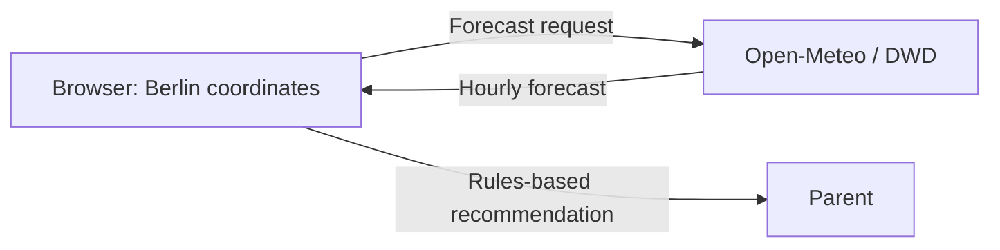

# Toddler Outfit Advisor — Prototype Design Document

> **Purpose:** A Claude Code–ready specification for a small, intuitive web app that recommends what a three-year-old should wear to kindergarten in Berlin each morning.
>
> **Implementation target:** Vanilla JavaScript (ECMAScript 2025), Vite, Vitest, and no TypeScript.
>
> The weather service specified below, Open-Meteo, does **not** need an API key for this non-commercial prototype. The app uses no AI service.

---

## 1. Product summary

**Toddler Outfit Advisor** turns Berlin’s forecast into one clear, parent-controlled clothing recommendation. It shows:

1. a visual illustration of the recommended outfit;
2. a readable list of garments to put on;
3. a graphic, hour-by-hour view of today’s weather; and
4. short, transparent reasons such as “Feels like 7°C in the morning” and “Rain likely in the afternoon.”

The app uses local, deterministic weather rules to select from predefined outfits. The recommendation is guidance, never a safety authority or medical advice.

### 1.1 Target user and morning flow

The primary user is a parent at home in the morning, likely using a phone.

1. Open the app.
2. See today’s Berlin forecast and the default weather-rules recommendation immediately.
3. Read the prominent outfit illustration, garment checklist, and “why” chips.
4. Check the hourly chart if a rain or temperature change is expected later.
5. Make the final parent decision.

The app should feel useful in under **10 seconds**, without requiring an account or configuration before weather information appears.

### 1.2 Product principles

- **One clear answer first.** The main recommendation is unmissable; details are available but secondary.
- **No invented garments.** Recommendations come only from the outfit catalog.
- **Conservative around rain and cold.** When rain and cold coincide, prefer the warmer, rain-ready outfit.
- **Transparent rather than authoritative.** Show the actual weather signals used and communicate that a parent should consider the child, activity level, and kindergarten policy.
- **Private by default.** No accounts, analytics, tracking, or server-side storage in the prototype.
- **Mobile-first and accessible.** Large tap targets, readable contrast, keyboard usability, and a text alternative for every visual chart.

---

## 2. Scope

### In scope for prototype v1

- Berlin as the preconfigured location (`52.5200, 13.4050`, `Europe/Berlin`).
- Fetch the current conditions and today’s hourly forecast.
- Display a composable, in-app SVG outfit illustration — no third-party image assets required.
- Display eight canonical outfit combinations built from one garment catalog.
- Make a deterministic rules recommendation.
- Render an hourly temperature/apparent-temperature line plus precipitation-probability bars.
- Handle loading, stale, network, and API error states gracefully.
- Unit and DOM/integration tests with Vitest.

### Explicitly out of scope for v1

- Login, user accounts, sync, notifications, email, or background jobs.
- A production backend or server-side secret storage.
- Medical, health, UV, allergy, or school-policy guidance.
- Automatic purchase lists or wardrobe inventory.
- Historical personalization or learning from past parent choices.
- A claim that the app is “accurate” or a guarantee that a child will be warm/dry.

### Design-for-later, but do not build in v1

- Location search and saved locations.
- Parent-adjustable temperature/rain thresholds.
- A visual editor for additional outfit combinations.
- Localization (start English; keep all visible strings in one `copy.js` module so German can be added cleanly).

---

## 3. Integration decisions and trade-offs

### 3.1 Weather data options

| Approach | Trade-offs | Cost | Setup complexity |
| --- | --- | ---: | --- |
| **Open-Meteo using DWD ICON-D2** | No client secret; direct browser-friendly forecast request; DWD’s high-resolution Germany/Central Europe model is highly relevant to Berlin. This is weather-model output, not a guarantee. | Free/open-access tier for non-commercial prototype use; rate limits apply. | Low |
| **meteoblue Forecast API** | Strong multi-model/observation approach and forecast products, but requires an API key/trial and introduces client-side key-protection work in a pure frontend app. | Trial/free offering exists; paid usage is request/plan based. | Medium |

**Prototype selection dictated by the brief:** use **Open-Meteo with `models=dwd_icon_d2`**. It best fits “cheap, precise for Berlin, pure frontend” because it requires no weather key. Open-Meteo documents ICON-D2 as roughly 2 km, 15-minute data for Central Europe with updates every three hours; the prototype renders the safer, easier-to-read hourly series.

---

## 4. Technology and project setup

### Required stack

- **Language:** ECMAScript 2025 JavaScript; no TypeScript files, types, transpiled type syntax, React, Vue, or other frontend framework.
- **Tooling:** Vite (vanilla template) and Vitest.
- **Test DOM:** jsdom, used only in development tests.
- **Runtime dependencies:** none.
- **Chart:** custom Canvas 2D implementation plus an accessible HTML text/table alternative. Do not add a chart library for this one chart.
- **Illustration:** SVG and CSS defined in the app; do not fetch remote image assets.

### Bootstrap commands

```bash
npm create vite@latest toddler-outfit-advisor -- --template vanilla
cd toddler-outfit-advisor
npm install
npm install --save-dev vitest jsdom
```

Add these npm scripts while retaining Vite’s normal scripts:

```json
{
  "scripts": {
    "dev": "vite",
    "build": "vite build",
    "preview": "vite preview",
    "test": "vitest run",
    "test:watch": "vitest"
  }
}
```

### Required project structure

```text
toddler-outfit-advisor/
├── index.html
├── package.json
├── vite.config.js
├── src/
│   ├── main.js
│   ├── styles.css
│   ├── copy.js
│   ├── data/
│   │   └── outfits.js
│   ├── domain/
│   │   ├── forecast.js
│   │   └── recommendation.js
│   ├── services/
│   │   └── weather-service.js
│   └── ui/
│       ├── app.js
│       ├── recommendation-card.js
│       ├── outfit-illustration.js
│       ├── hourly-chart.js
│       └── status-banner.js
└── tests/
    ├── setup.js
    ├── fixtures.js
    ├── forecast.test.js
    ├── recommendation.test.js
    ├── weather-service.test.js
    └── app.test.js
```

Use native ES modules throughout. Keep business logic in `src/domain/`; UI modules must not decide which outfit is appropriate.

---

## 5. Outfit catalog and recommendation policy

### 5.1 Canonical v1 catalog

Use stable IDs. Visible labels should be friendly and correct the obvious misspellings in the source requirements (`pants`, `sweater`, `socks`). In the UI, label “water shoes” as **“waterproof shoes”** with an optional parent-facing parenthetical “(water shoes)” until the wording is confirmed.

| ID | Parent-facing name | Garments |
| --- | --- | --- |
| `sunny-hot` | Sunny & hot | Sun hat; short-sleeve T-shirt; shorts; sandals |
| `mild-dry` | Mild & dry | Long-sleeve T-shirt; sweater; long pants; socks; closed shoes |
| `fresh-dry` | Fresh & dry | Long-sleeve T-shirt; sweater; jacket; long pants; socks; closed shoes |
| `cold-dry` | Cold & dry | Hat; neck warmer; long-sleeve T-shirt; sweater; jacket; long pants; socks; closed shoes |
| `hot-rain` | Rainy & mild | Long-sleeve T-shirt; sweater; rain jacket; long pants; socks; waterproof shoes |
| `cold-rain` | Cold & rainy | Hat; neck warmer; long-sleeve T-shirt; sweater; jacket; long pants; mud overalls; socks; waterproof shoes; umbrella |
| `super-rain` | Pouring rain | Long-sleeve T-shirt; sweater; rain jacket; long pants; mud overalls; socks; wellington boots; umbrella |
| `super-cold` | Freezing | Warm hat; neck warmer; thermal underwear; long-sleeve T-shirt; sweater; snowsuit; socks; winter boots; gloves |

A neck warmer replaces a scarf because many kindergartens do not allow scarves (they can catch on playground equipment). Mud overalls (German: *Matschhose*) replace separate rain pants.

Define this once in `src/data/outfits.js` rather than duplicating garment strings in the UI, rules, and tests. Garments live in their own catalog, keyed by an id that is also the illustration layer and the icon name. Each garment belongs to one body section:

| Section id | Checklist label | Garments |
| --- | --- | --- |
| `head` | Head | sun hat, hat, warm hat, neck warmer |
| `middle` | Body | thermal underwear, short/long-sleeve T-shirt, sweater, jacket, rain jacket, snowsuit |
| `low` | Legs | shorts, long pants, mud overalls |
| `bottom` | Feet | socks, sandals, closed shoes, waterproof shoes, wellington boots, winter boots |
| `carry` | Carry | umbrella, gloves |

```js
export const GARMENTS = {
  sunHat: { label: 'Sun hat', section: 'head' },
  // …
  waterproofShoes: { label: 'Waterproof shoes', section: 'bottom', note: '(water shoes)' },
  // …
};

export const OUTFITS = [
  {
    id: 'sunny-hot',
    label: 'Sunny & hot',
    description: 'Light clothes and sun protection for a dry, warm, sunny kindergarten day.',
    garments: ['sunHat', 'shortTee', 'shorts', 'sandals'],
    tags: ['dry', 'warm', 'sunny']
  },
  // …
];
```

Outfits that already protect against rain carry the `waterproof` tag.

### 5.2 “Other combinations”

The catalog is exactly the eight combinations above. Add further records, and garments, only in `src/data/outfits.js`.

Later combinations can be added as catalog entries with the same fields. Examples to consider only after a parent specifies their actual wardrobe:

- windy but dry;
- spare clothes to pack in the backpack;
- a lighter rain-shell option.

The recommendation keeps a `baseOutfit` plus `addOns` structure: if rain is likely and the chosen outfit is not tagged `waterproof`, a “Pack rain gear” add-on is attached. With the current catalog every rainy branch already picks a waterproof outfit.

### 5.3 Configurable defaults

Place thresholds in a small exported constant in `src/domain/recommendation.js`. These are **defaults**, not objective child-safety thresholds. Give the user a future settings surface rather than hard-coding an unchangeable claim.

```js
export const DEFAULTS = {
  timezone: 'Europe/Berlin',
  dayStartHour: 7,
  dayEndHour: 22,
  hotMinimumApparentC: 22,
  mildMinimumApparentC: 16,
  freshMinimumApparentC: 9,
  sunnyMaximumCloudCover: 35,
  sunnyMinimumFraction: 0.65,
  rainProbabilityThreshold: 50,
  rainAmountThresholdMm: 0.3,
  coldRainMaximumApparentC: 12,
  freezingMaximumApparentC: 0,
  heavyRainTotalMm: 5,
  cacheMinutes: 15
};
```

The app tracks the whole day, 07:00–22:00 local Berlin time, hour by hour. The outfit decision only looks at the hours still ahead: from the current hour to 22:00 (the whole day before 07:00, only 22:00 after it). When the clock enters a new hour, the recommendation is recomputed. Show the evaluated range in the interface.

### 5.4 Deterministic baseline algorithm

`deriveDaySummary(forecast, DEFAULTS, { fromHour })` should work only on the hours from `fromHour` (clamped into 07–22) to 22:00 and return a plain object such as:

```js
{
  window: { start: '09:00', end: '22:00', hourCount: 14 },
  minApparentC: 7.4,
  maxApparentC: 13.1,
  rainLikely: true,
  maxRainProbability: 70,
  precipitationTotalMm: 2.1,
  sunnyFraction: 0.10,
  maxWindKmh: 22,
  reasons: [
    'Feels like 7°C in the morning',
    'Rain is likely (up to 70%)',
    'Breezy at times (up to 22 km/h)'
  ]
}
```

Rules, in order:

```text
1. Evaluate only the current hour to 22:00 local Berlin time (within 07:00–22:00).
2. rainLikely = any hourly precipitation probability >= 50
                OR total precipitation in the window >= 0.3 mm.
3. hotAndSunny = rainLikely is false
                 AND minimum apparent temperature >= 22°C
                 AND at least 65% of window hours have cloud cover <= 35%.
4. If minimum apparent temperature < 0°C: choose super-cold (the snowsuit is waterproof, so this wins over rain).
5. Else if rainLikely AND total precipitation >= 5 mm: choose super-rain.
6. Else if rainLikely AND minimum apparent temperature < 12°C: choose cold-rain.
7. Else if rainLikely: choose hot-rain.
8. Else if hotAndSunny: choose sunny-hot.
9. Else if minimum apparent temperature >= 16°C: choose mild-dry.
10. Else if minimum apparent temperature >= 9°C: choose fresh-dry.
11. Else: choose cold-dry.
```

Do not force the `cold-rain` outfit on a warm rainy day; `hot-rain` keeps the lighter layers and swaps in a rain jacket and waterproof shoes.

---

## 6. Weather integration

### 6.1 Provider and endpoint

Use Open-Meteo’s forecast API with DWD ICON-D2 for the Berlin default.

```text
GET https://api.open-meteo.com/v1/forecast
```

Build the URL with `URL` and `URLSearchParams`; do not hand-concatenate user-controlled values.

```js
const endpoint = new URL('https://api.open-meteo.com/v1/forecast');
endpoint.search = new URLSearchParams({
  latitude: '52.5200',
  longitude: '13.4050',
  current: [
    'temperature_2m',
    'apparent_temperature',
    'precipitation',
    'weather_code',
    'cloud_cover',
    'wind_speed_10m'
  ].join(','),
  hourly: [
    'temperature_2m',
    'apparent_temperature',
    'precipitation_probability',
    'precipitation',
    'weather_code',
    'cloud_cover',
    'wind_speed_10m',
    'wind_gusts_10m',
    'is_day'
  ].join(','),
  daily: [
    'weather_code',
    'temperature_2m_max',
    'temperature_2m_min',
    'apparent_temperature_max',
    'apparent_temperature_min',
    'precipitation_probability_max',
    'precipitation_sum',
    'sunrise',
    'sunset'
  ].join(','),
  forecast_days: '1',
  timezone: 'Europe/Berlin',
  models: 'dwd_icon_d2'
});
```

A live validation on 25 September 2026 confirmed that this shape returns the requested current fields, hourly fields, daily fields, 24 hourly records, and `Europe/Berlin` timestamps.

### 6.2 Fetching behavior

Implement `fetchBerlinForecast({ signal } = {})` in `weather-service.js`.

- Use `fetch` with an `AbortController` and an 8-second timeout.
- Throw a typed `WeatherServiceError` with a safe user-facing message for non-OK responses, invalid JSON, and malformed payloads.
- Normalize every API response into an application-owned forecast structure; components must not consume provider JSON directly.
- Cache the normalized result plus `fetchedAt` in `sessionStorage` for 15 minutes. This avoids needless calls while remaining fresh enough for a morning check.
- Include a **Refresh** button. It bypasses the cache, aborts a prior in-flight request, and sets `aria-busy="true"` on the weather region.
- If the explicit `dwd_icon_d2` request fails because of an availability issue, retry once with `models=auto`; annotate the developer-only normalized source as `auto`. Do not expose technical model names in the parent UI.
- Do not store weather data remotely.

### 6.3 Normalized domain shape

```js
{
  location: { label: 'Berlin', latitude: 52.52, longitude: 13.405 },
  timezone: 'Europe/Berlin',
  fetchedAt: '2026-09-25T07:05:00.000Z',
  current: {
    time: '2026-09-25T09:00',
    temperatureC: 10.2,
    apparentTemperatureC: 8.9,
    precipitationMm: 0,
    weatherCode: 3,
    cloudCoverPercent: 94,
    windKmh: 16
  },
  hours: [{
    time: '2026-09-25T08:00',
    hour: 8,
    temperatureC: 9.8,
    apparentTemperatureC: 8.1,
    precipitationProbabilityPercent: 15,
    precipitationMm: 0,
    weatherCode: 2,
    cloudCoverPercent: 70,
    windKmh: 14,
    windGustKmh: 24,
    isDay: 1
  }],
  day: {
    date: '2026-09-25',
    lowC: 7.8,
    highC: 15.2,
    apparentLowC: 6.0,
    apparentHighC: 13.6,
    precipitationProbabilityMaxPercent: 70,
    precipitationTotalMm: 2.1,
    weatherCode: 61,
    sunrise: '2026-09-25T06:53',
    sunset: '2026-09-25T19:05'
  }
}
```

### 6.4 Weather-code presentation

Map documented WMO codes to a small app-owned metadata object:

```js
export const WEATHER_META = {
  0: { label: 'Clear sky', icon: 'sun' },
  1: { label: 'Mostly clear', icon: 'sun-cloud' },
  2: { label: 'Partly cloudy', icon: 'cloud-sun' },
  3: { label: 'Overcast', icon: 'cloud' },
  45: { label: 'Foggy', icon: 'fog' },
  48: { label: 'Icy fog', icon: 'fog' },
  51: { label: 'Light drizzle', icon: 'drizzle' },
  53: { label: 'Drizzle', icon: 'drizzle' },
  55: { label: 'Heavy drizzle', icon: 'drizzle' },
  61: { label: 'Light rain', icon: 'rain' },
  63: { label: 'Rain', icon: 'rain' },
  65: { label: 'Heavy rain', icon: 'rain' },
  71: { label: 'Light snow', icon: 'snow' },
  73: { label: 'Snow', icon: 'snow' },
  75: { label: 'Heavy snow', icon: 'snow' },
  80: { label: 'Rain showers', icon: 'rain' },
  81: { label: 'Heavy showers', icon: 'rain' },
  82: { label: 'Violent showers', icon: 'rain' },
  95: { label: 'Thunderstorm', icon: 'storm' },
  96: { label: 'Thunderstorm with hail', icon: 'storm' },
  99: { label: 'Severe thunderstorm with hail', icon: 'storm' }
};
```

Use an `unknown` fallback for unmapped codes so an API update cannot break the UI.

---

## 7. Interface specification

### 7.1 Visual direction

Create a warm, calm, modern interface for a busy parent. It should be playful enough to feel child-adjacent but not cartoonish or cluttered. The reference design is `docs/template/index.html`: a sky-blue hero with rounded bottom corners, warm brown ink, cream cards, pill chips and a yellow accent.

**Design tokens:**

```css
:root {
  --clr-text: #4A3320;          /* ink, chart line */
  --clr-muted: #765F4D;         /* AA on white and cream */
  --clr-accent: #F4CE6A;        /* "Before you go" note, current hour */
  --clr-accent-strong: #E8A200; /* sun glyphs, chip icons */
  --clr-surface: #F7F3EE;       /* outfit card, past hours */
  --clr-sky: #A8D7E8;           /* hero, rain bars */
  --clr-sky-strong: #4A90B8;    /* rain glyphs */
  --clr-bg: #FFFFFF;
  --clr-border: rgb(74 51 32 / 0.08);
  --danger: #B42318;
  --focus: #4A3320;
  --radius-xl: 32px; --radius-lg: 24px; --radius-md: 16px; --radius-pill: 999px;
}
```

- Headings in **Outfit**, body in **Plus Jakarta Sans**, both self-hosted through `@fontsource` packages and bundled by Vite; system sans-serif fallback. 44px minimum touch targets.
- Prefer text labels plus icons; never rely on color alone.
- No remote web fonts, remote icon kits, or image CDNs.
- Respect `prefers-reduced-motion` and use no auto-playing animation.

### 7.2 Page structure

```text
<header>
  Brand: “Ready to go”
  Location: Berlin · Updated 07:12
  [Refresh]
</header>

<main>
  <section aria-labelledby="today-heading">                 // Weather snapshot
    Today in Berlin · Friday, 25 September
    10° · Feels like 8° · Overcast
    High/Low pills · alert pills · reason chips
  </section>

  <section aria-labelledby="outfit-heading">                // Primary recommendation
    “Put on today”
    Cold & rainy
    Garment checklist + composable child/outfit illustration
    [View decision details]
  </section>

  <section aria-labelledby="forecast-heading">              // Hourly evidence
    “Today, hour by hour”
    Canvas chart
    Text legend
    Accessible hourly table in <details>
  </section>

  <section aria-labelledby="tips-heading">                  // Calm disclaimer
    “Before you go”
    “Forecasts can change. Consider your child’s comfort, activity, and kindergarten rules.”
  </section>
</main>

<footer>
  Weather data: Open-Meteo / DWD · Forecasts are estimates
</footer>
```

**All widths:** one centred column, at most 600px wide, in the order above. The snapshot lives in the sky-blue hero together with the brand and Refresh button: big current temperature, “Feels like … · condition”, `Berlin · Updated …`, High/Low pills, and alert pills for the hours still ahead (rain chance when rain is likely, warmest hour), followed by the outfit’s reason chips in the same pill style. The hour-by-hour section carries the “We track the whole day…” note. The graphic must be clearly readable without pinch zoom.

### 7.3 Recommendation card

The recommendation card is the visual focal point.

- Header: `PUT ON TODAY` in small uppercase letter spacing; then friendly outfit name.
- Illustration: a neutral, simple child silhouette with layered SVG elements. Each garment in the catalog maps to an SVG `<g>` with meaningful `aria-label` text and a distinct garment color/shape.
- Garment checklist: garments grouped into rows by body section (Head, Body, Legs, Feet, Carry) with a short hint per section; each garment is a white pill with an inline SVG garment icon and text.
- Reason chips (shown in the hero, see 7.2): maximum three, generated from `daySummary.reasons`. Examples:
  - `Feels like 7°C in the morning`
  - `Rain likely in the afternoon`
  - `Breezy — up to 22 km/h`
- Source line: `Weather rules`.
- Do not display a child’s age in the card.

### 7.4 Outfit illustration

Create the illustration with semantic SVG groups, not a single inaccessible image.

Layers are grouped by body section, inner to outer within a section. Sections are drawn in this order so outer garments cover inner ones:

```text
body → low (legs) → bottom (feet) → middle (body) → head → carry
```

Shoes cover the trouser hems, tops and the snowsuit cover the waistband and boot tops, the neck warmer and hats cover the jacket collar, and the umbrella goes last.

Implementation constraints:

- `renderOutfitIllustration(outfit)` returns a string or DOM fragment with `<svg role="img" aria-label="Illustration: …">`.
- Provide a text label beneath the SVG (`Illustration: Cold & rainy outfit`) as a no-graphics fallback.
- Use a compact weather backdrop in the illustration (sun/cloud/rain/snow), but not a second data source.
- An umbrella must not hide garment layers or the accessible label.

### 7.5 Hourly weather chart

Use a `canvas` only after it has a textual equivalent.

**Chart data:** every hour from 07:00 to 22:00 local time, including hours that have already passed.

**Render:**

- Primary line: apparent temperature in °C, labeled in the legend.
- Bars: precipitation probability percent, with a clearly separate right axis or labeled baseline.
- Tiny weather glyph from WMO codes, every hour when there is room, otherwise every 2–3 hours.
- The current hour marked clearly: a full-height highlighted column, a larger ringed dot on the line, a bold hour label and a “Now” pill. Past hours get a subtle grey background. The marker moves when the clock enters a new hour.
- Horizontal grid labels at round temperature values; x-axis labels at readable intervals.
- A chart title: `Hourly forecast — apparent temperature and rain chance`.
- On canvas resize, redraw using `devicePixelRatio`; avoid blurry graphics.

**Accessible alternative:** a collapsed `<details>` named “View the hourly forecast as a table” with columns: time, feels like, rain chance, condition, wind. The current hour's row is highlighted with a “Now” tag and `aria-current="time"`; past rows are muted. The table is also the fallback if canvas is unavailable.

### 7.6 Loading and error states

| Condition | UI behavior |
| --- | --- |
| Initial weather load | Skeleton for snapshot/card/chart, then live content. Never show a blank white page. |
| Weather unavailable and cache exists | Show cached recommendation with `Last updated at …` and a retry button. |
| Weather unavailable and no cache | Clear error card: “Today’s forecast could not load. Check your connection and try again.” |

### 7.7 Accessibility acceptance targets

- Keyboard navigation reaches Refresh, decision details, and the chart table disclosure in a logical order.
- Visible focus ring uses `--focus` with 3:1+ contrast to adjacent colors.
- Buttons and icon controls have names.
- Chart has a title, legend, accessible table, and no color-only meaning.
- `aria-live="polite"` announces a finished refresh; do not announce every animated/skeleton update.
- Meet WCAG AA contrast for normal text. Test at 320px width and 200% browser zoom.

---

## 8. Application state and data flow

### 8.1 State machine

Keep a single explicit state object in `ui/app.js`; do not make modules mutate the DOM from arbitrary callbacks.

```js
const initialState = {
  weather: { status: 'idle', data: null, error: null, isStale: false },
  recommendation: { source: 'rules', outfitId: null, addOns: [], reasons: [] }
};
```

Status values:

```text
weather.status: idle | loading | ready | error
```

### 8.2 Startup path

```text
1. Render static shell + loading state.
2. Read a fresh cached normalized forecast if available; render it as stale if present.
3. Fetch Open-Meteo in parallel.
4. Normalize data and derive day summary.
5. Run deterministic recommendation.
6. Render snapshot, recommendation, reasons, illustration, chart, and table.
```

### 8.3 Privacy-aware data flow



The only network request is the forecast request. Do not send browser data, child identity, or stored preferences to any third party.

---

## 9. Test plan

### 9.1 Unit tests

Use deterministic fixtures, never live APIs, in unit tests.

| Module | Cases |
| --- | --- |
| `forecast.js` | Align parallel provider arrays by index; select only 07:00–22:00 Berlin hours; find the current hour; map known and unknown WMO codes; handle missing optional values. |
| `recommendation.js` | Hot/sunny/dry → `sunny-hot`; mild/dry → `mild-dry`; fresh/dry → `fresh-dry`; cold/dry → `cold-dry`; cold/rainy → `cold-rain`; warm/rainy → dry base with rain-gear add-on. |
| `weather-service.js` | Correct `URLSearchParams`; normalized success response; API error; malformed payload; 8-second abort; one DWD-to-auto fallback. |

### 9.2 DOM/integration tests

With `jsdom` and mocked services:

- Initial state includes an accessible loading indicator.
- A successful forecast renders the location, updated time, outfit label, garment list, reasons, and hourly-table rows.
- The Refresh button triggers a fresh fetch.
- A weather failure shows retry/error content.
- Canvas failure still leaves the hourly-table disclosure available.

### 9.3 Manual acceptance checklist

Run before handoff:

```bash
npm run test
npm run build
npm run dev
```

Then manually verify in a browser:

- 320px-wide phone viewport, standard desktop viewport, and 200% zoom.
- keyboard-only interaction.
- every weather scenario via the development-only weather simulator panel (`npm run dev`), which also sets a frozen clock and the loading, offline and stale states; views are bookmarkable, e.g. `/?fixture=storm&now=15:30&state=stale`.
- slow network/disabled network while a cache is present and absent.

---

## 10. Definition of done

The prototype is complete when all of the following are true:

1. `npm run build` completes successfully.
2. `npm run test` completes successfully with coverage of all outfit branches.
3. The application loads Berlin weather and selects a rules-based outfit.
4. The hourly chart and accessible table use the same normalized forecast data.
5. The eight catalog outfit combinations appear correctly with accurate garment lists and SVG layers.
6. UI error states are clear, non-technical, and never reveal a raw provider response.
7. Attribution to Open-Meteo/DWD appears in the footer, consistent with the provider’s CC BY attribution requirement.

---

## 11. Implementation sequence for Claude Code

1. **Scaffold only.** Create the Vite vanilla project, install Vitest/jsdom, add the file structure, scripts, test configuration, and an empty static shell.
2. **Build the domain first.** Implement fixtures, WMO mapping, normalizer, day summary, and rules engine with passing tests before adding styled UI.
3. **Integrate weather.** Add the Open-Meteo DWD request, caching, timeout/fallback, errors, and a live Berlin smoke-test path. Keep weather code separate from rendering.
4. **Build the core UI.** Add responsive snapshot, recommendation card, garment checklist, composable SVG illustration, reason chips, and hourly chart/table.
5. **Finish accessibility and polish.** Test keyboard flow, focus, contrast, resize, reduced motion, and empty/error states.
6. **Run final checks.** Run build and tests.

### Claude Code guardrails

- Use **only vanilla JavaScript**, HTML, and CSS. Do not introduce TypeScript, React, a state-management library, a chart library, an icon library, or an image CDN.
- Do not replace the local rules engine with an AI service.
- Do not invent clothes or modify the canonical catalog outside `src/data/outfits.js`.
- Keep error text user-friendly, while leaving diagnostic details only in test assertions/developer exceptions.

---

## 12. Source notes (verified 25 September 2026)

- [Open-Meteo Forecast API documentation](https://open-meteo.com/en/docs) — hourly/current/daily variables, timezone handling, model selection, WMO weather codes, and forecast endpoint behavior.
- [Open-Meteo DWD ICON API documentation](https://open-meteo.com/en/docs/dwd-api) — ICON-D2 Central Europe coverage, roughly 2 km spatial resolution, 15-minute data, and three-hour update cadence.
- [Open-Meteo pricing and licence information](https://open-meteo.com/en/pricing) — free/open-access prototype use, non-commercial limits, and attribution requirement.
- [meteoblue Weather API overview](https://docs.meteoblue.com/en/weather-apis/introduction/overview) and [product page](https://business.meteoblue.com/products/weather-apis) — alternative forecast API, trial/key requirement, and frontend key-protection features.
